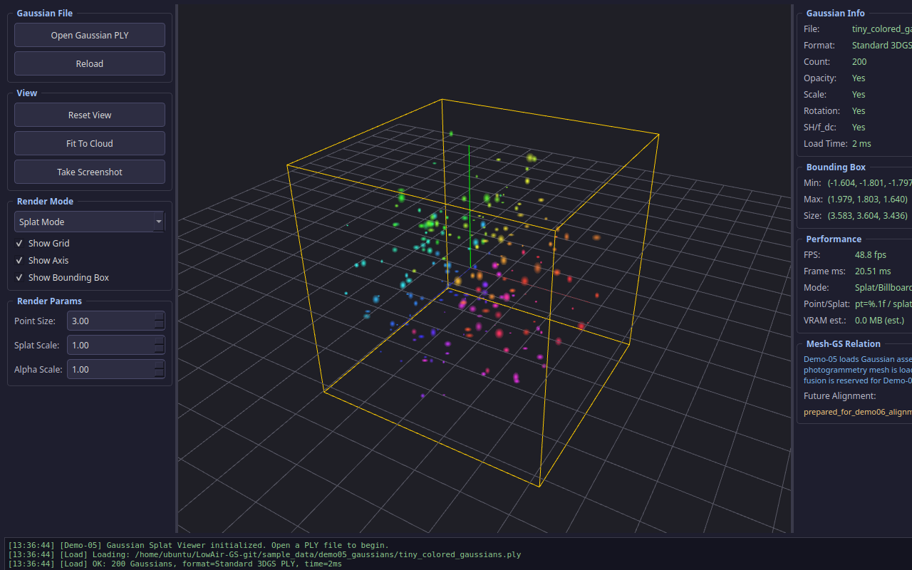
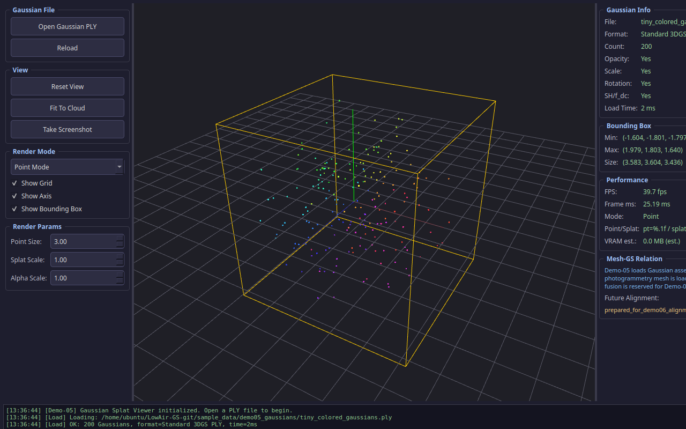
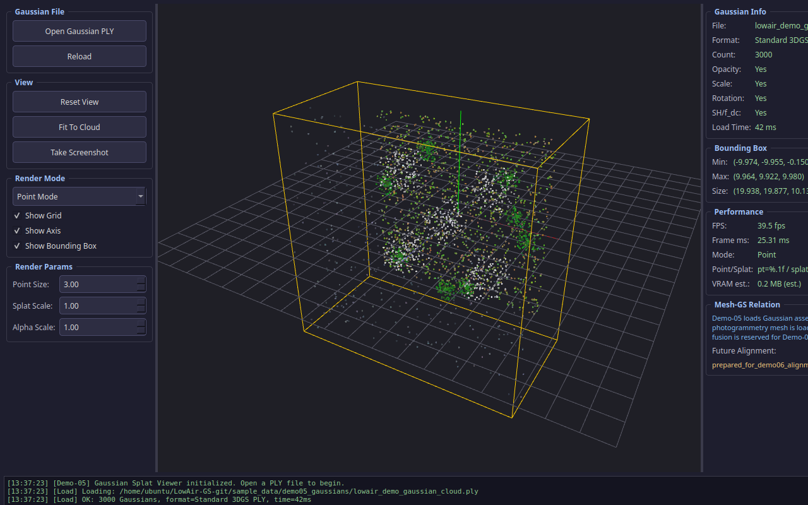

# Demo-05: Gaussian Splat Viewer

本 Demo 演示了如何使用 C++ 和 Qt OpenGL 独立加载和渲染 3D Gaussian Splatting（3DGS）场景。这是构建“低空数字孪生”环境的重要一步。

## 1. 核心功能

- **PLY 解析器**：支持标准 3DGS PLY 格式，解析位置、颜色（SH/f_dc）、不透明度、缩放和旋转四元数。
- **双模式渲染**：
  - **Point Mode**：将 Gaussian 渲染为带颜色的点，适合快速预览和调试。
  - **Splat Mode**：使用 Billboard 渲染技术，将 Gaussian 渲染为朝向相机的椭圆面片，模拟真实的 3DGS 渲染效果。
- **性能统计**：实时显示帧率（FPS）、帧耗时（ms）和 VRAM 显存占用估算。
- **包围盒计算**：自动计算场景包围盒（Bounding Box），支持“Fit To Cloud”视角重置。

## 2. 编译与运行

### 2.1 依赖项
- Qt 6.x (Core, Gui, Widgets, OpenGLWidgets)
- OpenGL 3.3+

### 2.2 编译步骤
```bash
mkdir build && cd build
cmake .. -DCMAKE_BUILD_TYPE=Release
make -j$(nproc)
```

### 2.3 运行方式
```bash
# 启动程序（可通过 UI 面板打开文件）
./Demo05GaussianSplatViewer

# 启动并直接加载示例数据
./Demo05GaussianSplatViewer --gaussian ../../../sample_data/demo05_gaussians/lowair_demo_gaussian_cloud.ply
```

## 3. 验收截图展示

| 程序启动状态 | 加载小型点云 (Splat) | 加载小型点云 (Point) |
|:---:|:---:|:---:|
|  |  |  |

| 加载低空场景 (Splat) | 加载低空场景 (Point) | 旋转视角完整统计 |
|:---:|:---:|:---:|
|  |  |  |

## 4. 技术边界与后续计划

- **当前实现**：实现了标准的 3DGS PLY 解析和基于 Billboard 的基础 Splat 渲染。为了保持代码轻量和跨平台兼容，当前使用的是基于 CPU 排序（或不排序直接开启深度测试）的基础 OpenGL 渲染，而非基于 CUDA 的官方高性能光栅化器。
- **与摄影测量的关系**：Demo-05 仅加载 Gaussian 资产。摄影测量 Mesh（Demo-02）与 Gaussian 资产的联合加载与坐标对齐将在 **Demo-06** 中实现。
